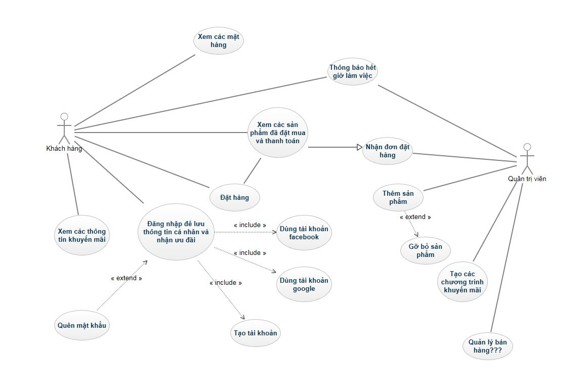

01/03/2017 - Nhóm BETEZ

Dự án: Xây dựng website kinh doanh đồ uống
=====

Nội dung
-----

Xây dựng một website đơn giản giúp khách hàng có thể mua đồ uống online ship tận nhà. Khách hàng có thể login(không bắt buộc) để lưu thông tin cá nhân tiện sử dụng sau này, cùng với ưu đãi cho khách hàng thân thiết. 

### Các ngôn ngữ, kỹ thuật dự kiến sẽ sử dụng:
- HTML, CSS, PHP, Javascript, SQL
- bootstrap, jQuery, ajax
- Facebook API, Google API

### Ứng dụng tham khảo:
www.caferio.com, pizzahut.com

### Sơ đồ Usecase

[Cucumber Features](usecase.feature)
